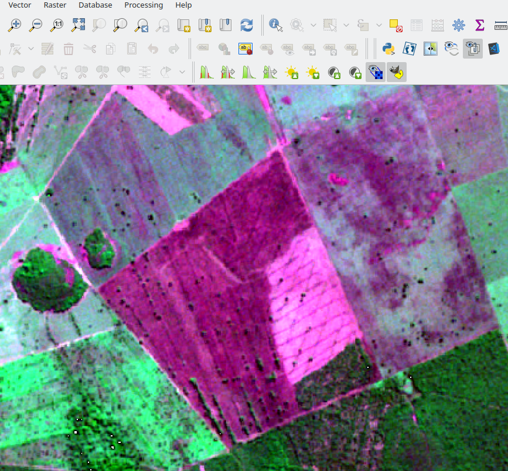
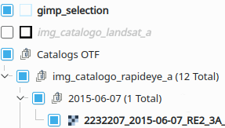
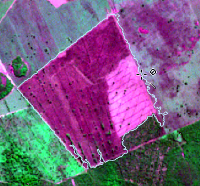

# Gimp Selection Feature Plugin  

***Gimp Selection Feature*** makes it easy to create polygon from image using the [Gimp selection tools](https://docs.gimp.org/en/gimp-tools-selection.html).  

The ***Gimp Selection Feature***  is a panel plugin that permit send the image of view of map to GIMP, and, get the region selected by GIMP how a feature in QGIS.  

## Steps: ##  

* **Open GIMP :**  
Run IBAMA plugin
  
  

* **Send image to GIMP :**  
Mark the visible images that you want send to GIMP. Of course, the images need be neighbours.  
  
  
  

* **Select region in GIMP :**  
  
Use the tools for select a region inside image.  
  
Select the tool that  you want.  
In example, the "Fuzzy Select" tool and removes the holes.  
  

* **Get features :**  
  
The button "Get Features" get the selection region how a feature in QGIS, creating the "gimp_selection" layer(polygon) if not exists.  
The settings:
  * Annotation: The text to use for identify the polygon.
  * Remove area: The maximum size of area that will be remove.
  * Remove vertex: The limit angle between neighbours vertex, below this value the vertices will be remove.
  * Smooth(Chaikin algorithm):
  * Level: Number of interations.
  * Fraction of line: Percentage of line to begin create vertex.
  * Ajust the borders: Remove overlap and gap between the borders between the new and the exists geometries.

* Getting the first feature:

* Increase the "Remove area"(500 pixels), "Remove last features" and "Get features" again:  

## Attributes of gimp_selection layer: ## 
  
* id_add: The index of the feature added.
* total_imgs: Total of images sent to GIMP.
* images: The list of image(name and source)
* user: The name of user of machine.
* date_add: The date of the feature added.
* crs_map: CRS of map when the image was sent.
* extent_map: The extent of map when the image was sent.
* annotation: The text typed when the image was sent.
* area_ha: The hectare of geometry(it is a virtual field)  

 

## Considerations: ##

* The GIMP version tested was 2.10.8.
* The CRS of 'gimp_selection' layer is EPSG:4326
* If gimp_selection layer is visible, it is can send together with images.  

* Example of "Adjust the borders"
  * "Send image" with 'gimp_selection' layer.  
    
  * Create a selected region Create a selected region that is neighbor of other in Gimp.  
    
  * Get features without adjust(Overlap and Gaps).
    
  * "Remove last features", "Adjust the borders" and "Get features" again. 

